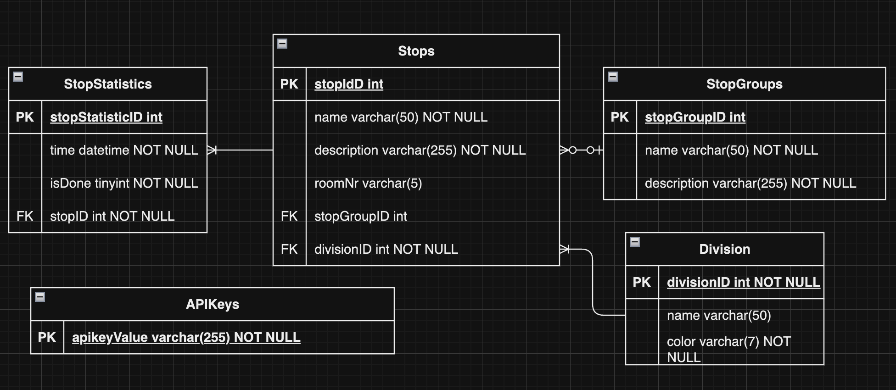

# TadeoTTools

## Sprint Planung
1. Milestone 8. Oktober: GUI-Mockups für Mobile als Prototyp
2. Milestone 5. November: Leitfaden + Unterpages der Touren, Datenmodell + Datenbank mit Zugriffsfunktionen + Schnittstellen
3. Milestone 5. Dezember: Admin-Dashboard + Stationen separate View 
4. Milestone 7. Jänner: Deployment, Authentication, Admin-Dashboard Anpassungen, 1:m bei Divisions, Init-Script automatisieren
5. Milestone 23. und 24. Jänner: Datenbank mit Echtdaten befüllen, Bugfixes, Tag der offenen Tür, System muss funktionieren + ein QR Code für generelle Website, falls noch Zeit Feedback

Weitere Milestones werden nach Feedback hinzugefügt.

## Team-Mitglieder
- Luca Haas
- Andreas Huber
- Melanie Dohr

Issues sind auf Jira zu finden : https://htblaleonding.atlassian.net/jira/software/projects/KAN/boards/1

## 1. Ausgangslage

### 1.1. Ist-Situation
Es gab bereits ein Projekt zu den TadeoT-Tools. Darin kann man Auswahllisten konfigurieren und Besucherdaten als CSV exportieren und sich die Fotos der Besucher ansehen. 

Unter Anmeldung erfolgt die Besucheranmeldung.

Außerdem werden Statistiken anhand der Daten erstellt und übersichtlich als Slideshow in verschiedenen Diagrammarten dargestellt.

Zudem gibt es eine Kassa-App und eine Darstellung der Erlöse, Produkte und des Kassastandes.

Dann gibt es noch eine Feedback-App, in der man als Besucher Feedback geben kann.

Man kann sich eine Feedback-Auswertung ansehen und alle Feedback-Antworten verwalten.

### 1.2. Verbesserungspotentiale

Das Design ist fragwürdig und viele Features noch nicht ganz ausgereift. Wir würden gerne das Projekt von Grund auf neu starten und somit ein sauberes Fundament schaffen.

## Zielsetzung: Interaktiver mobiler Besucherguide (+ für Guides)

Wir wollen eine Website, die auf mobile Geräte ausgelegt ist. Der Besucher bekommt bei der Anmeldung einen QR-Code und seine Besuchernummer (oder gemeinsam innerhalb eines zuvor generierten QR-Codes), durch die kommt er auf unsere Website. Als nächstes sieht der Besucher einen Leitfaden (z.B. Besucheranmeldung -> Kurzpräsentationen -> etc.). Dann bekommt er die Wahl zwischen den 2 verschiedenen Guide-Touren, sobald er eine Tour auswählt bekommt er eine Liste der Stationen, die bei der Tour besucht werden. Er kann auch die anderen Stationen ansehen. Als Tourguide kann man alle Stationen, die in einer Tour vorkommen, abhaken.

Mobile Version (wichtig!): 
- Stationen als Cards anzeigen, auch als "erledigt" setzen
- für Station Reminder "interessiert" setzen -> Auslastung!
- Station Auslastung ansehen
- Stationen bewerten
- auf Karte Stationen ansehen 
- Login System mit Besuchernummer (über QR Code bei Tablet) (Besuchernummer in localstorage)
- Besucher soll kein Feedback abgeben können, sobald nicht mehr in Schule oder in Zeitintervall
- dockern + hosten

Weitere Features:
- In-Haus Standort Recherche wegen neuen Technologien für Karte + Besucher-Stationen automatisch erkennen (?)
- Stations- und Mitarbeiterverwaltung
- Erstellung + Export von Schichtplänen pro Station
- Feedback-Fragen-Konfigurator
- Version Upgrades & Refactoring im Frontend Angular und im Backend .NET auf jeweils möglichst neue Version

Features, die schon existieren, deren genereller Aufbau aber Verbesserungspotential hat:
- Genereller Aufbau der Website (andere Sidebar, Links die teilweise nicht funktionieren)
- Kassa-App
- Buffet Statistiken 
- Buffet Verwaltung
- Administration Feedback

Noch unklar:
- Inwiefern? -> Warteschlangen-Management
- Aktueller Standpunkt? -> Historisierung (=> Archivierung der Daten von Vorjahren)
- Integration Schülys-Buffetgutscheinverwaltung -> möglich?

## User Stories
### 1. Main View mit Stationen als Cards

Als Besucher möchte ich auf der Seite nach dem Leitfaden alle Stationen als übersichtliche Karten sehen, um schnell Informationen zu bekommen und entscheiden zu können, welche ich besuchen möchte.

Akzeptanzkriterien:
   - Hauptseite zeigt Stationen als je nach Abteilung eingefärbte Karten mit Titel und Checkbox
   - Klicken auf eine Card führt zu Details einer Station.
   - Filter- und Suchfunktion für Stationen.
   - Die Stationen sind je nach Abteilung in der jeweiligen Farbe eingefärbt 

### 2. Station View + als interessiert / erledigt setzen + Auslastung
Als Besucher des TadeoT möchte ich Uhrzeiten, Name, Beschreibung, Auslastung und Standort einer bestimmten Station angezeigt bekommen. Außerdem möchte ich Stationen auf erledigt und für eine Uhrzeit interessiert setzen können.
Außerdem möchte ich auswählen können für welchen Kurs ich mich interessiere und 5 min vorher durch eine Benachrichtigung daran erinnert werden.

Akzeptanzkriterien:
- Alle Informationen (Uhrzeiten, Name, Beschreibung, Auslastung) werden als Text angezeigt. Standort wird auf einer Karte angezeigt (mit Weiterleitung zur Karte).
- Beim Klick auf den "Erinnere mich" Button wird die Station zu den interessierten Stationen hinzugefügt.
- Die Auslastung wird bei allen Benutzern geändert. 5 min vor Beginn der ausgewählten Einheit der Station wird, soweit der Benutzer es erlaubt, eine Benachrichtigung gesendet.

### 3. Karte mit Stationen
Als Besucher des TadeoT möchte ich eine interaktive Karte mit Stationen sehen, damit ich visuell die verfügbaren Stationen erkunden und durch Anklicken mehr Informationen zu den einzelnen Stationen erhalten kann.

Akzeptanzkriterien:
- Eine interaktive Karte wird angezeigt, auf der alle Stationen Symbole sichtbar sind. Die Karte kann verschoben und gezoomt werden, um verschiedene Räume anzuzeigen.
- Jede Station wird als anklickbarer Marker oder Symbol auf der Karte dargestellt.
- Beim Klick auf eine Station soll man zu einer Detailübersicht kommen

### 4. Leitfaden für Besucher
Als Besucher möchte ich einen Leitfaden haben, anhand dem ich mich orientieren kann, wann ich was erledige. Dieser Leitfaden soll nach der Anmeldung als erstes angezeigt werden.

Akzeptanzkriterien:
- Sobald man einen Punkt des Leitfadens auf erledigt setzt, wird der Punkt ausgegraut und gerät in den Hintergrund. Der nächste Punkt wird hervorgehoben
- Nach dem Punkt der Kurzpräsentation hat man die Wahl zwischen den 2 Touren, sobald man auf eine Tour klickt kommt man zur Stationenview mit dem Filter, dass nur die Stationen der jeweiligen Tour angezeigt werden

### 5. Login Screen mit Besuchernummer (bevor diese Userstory umgesetzt wird gibt es einen anonymen Modus)
Als Benutzer möchte ich mich mit meiner Besuchernummer anmelden und somit auf die Hauptseite weitergeleitet werden. 

Akzeptanzkriterien:
- Beim Klick auf den Anmelde Button wird der Inhalt des Textfeldes ausgelesen und mit der DB verglichen. Wenn diese übereinstimmen wird man auf die Hauptseite weitergeleitet.

### 6. Main View als Guide
Als Guide möchte ich statt dem Leitfaden sofort nach der Anmeldung meine eigenen Stationen in der richtigen Reihenfolge sehen, diese möchte ich zudem als "erledigt" setzen können (und auch wieder rückgängig machen). Das möchte ich, weil es für mich als Guide praktisch ist, nur alle meine Stationen pro Tour abzuhaken und dann wieder zurücksetzen zu können.

Akzeptanzkriterien:
- der Guide muss sich als solcher anders anmelden, sodass er den Leitfaden nicht angezeigt bekommt (auch dahingegend für Erweiterungen praktisch)

### 7. Stationsverwaltungsdashboard als Admin
Als Administrator möchte ich in der Form eines Dashbord Stationen hinzufügen und verändern können. Das möchte ich, damit die Besucher und Guides alle Stationen korrekt sehen können.

Akzeptanzkriterien:
- Stationen muss man hinzufügen können
- man soll Stationen auch verändern können

(im Moment unwichtig, erst nach Mobile View für Besucher)

(A) mehrere Stories für komplett neue UI (Ablauf aus Userperspektive)
(B) Stations- und Mitarbeiterverwaltung
(C) Erstellung + Export von Schichtplänen pro Station
(D) Feedback-Fragen-Konfigurator
   Als ein Administrator möchte ich einen Feedback-Fragen-Konfigurator für den Tag der offenen Tür erstellen damit: Besucher einfach Feedback zu ihrer Erfahrung geben und angeben können, ob sie sich vorstellen können, in Zukunft die Schule zu besuchen

  Akzeptanzkriterien:
  -	Der Administrator kann Fragen erstellen, bei denen es mehrere Antwortoptionen gibt.
  -	Die Fragen und Antworten werden in einer Datenbank abgespeichert.
  -	Der Administrator kann auch Fragen bearbeiten und löschen.
  -	Der Administrator erhält eine Ansicht über die aktuellen Fragen.

## GUI-Mockups
https://www.figma.com/design/S6GgNZndmHKVjgICvqunbq/User-Frontend?node-id=0-1&t=LRR9BtzlgJq6Yk8M-1

Farben:
- Buttons: #e8704f
- Secondary: #c81b6
- Accent: #B0AC96

Von Schulwebsite:
- Hinter Cards: #ededed
- Schrift: #000000
- Navbar: #ffffff 

## Chancen und Risiken
Wir haben die Chance, dass wir das Design auf ein höheres Niveau bringen. Zudem können wir eine integrierte Stationsverwaltung aufbauen. Außerdem werden wir den Code durch Refactoring und Version Upgrades auf ein neues Level befördern.
Ein Risiko ist, dass unser Design nicht gut genug wird. Zudem kann es sein, dass uns die Zeit ausgeht, um alle vorgenommenen Features zu implementieren. 

## Technologien
Frontend: 
- Angular mit Tailwind
- neueste Angular Version verwenden mit Signals
- (komplett neu aufsetzen)

Backend:
- .NET auf neueste Version upgraden
- (Große Teile übernehmen)

## Datenmodell

